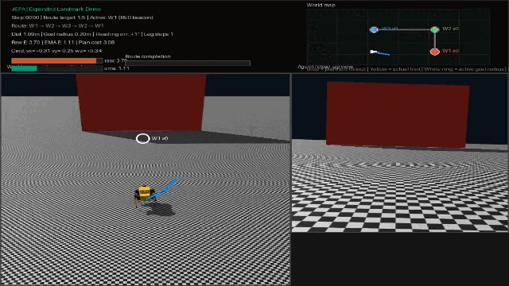
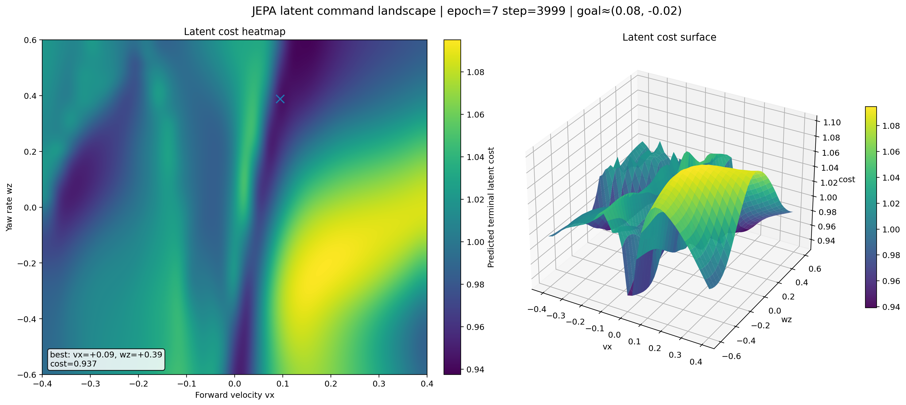

# TinyQuadJEPA

TinyQuadJEPA is a two-level quadruped stack:

- `System 1`: a PPO locomotion policy that turns body-frame commands into 12 joint targets.
- `System 2`: a JEPA-style latent world model that encodes RGB + proprioception, predicts future latents under commanded motion, and supports latent-space planning.

The current repository is best described as:

> an action-conditioned latent predictor trained with a VICReg objective, plus a post-hoc learned energy head for planning

It is JEPA-style because prediction happens in latent space instead of pixel reconstruction. It is not yet a canonical EMA-target JEPA.

## Demo

The main showpiece is the Genesis landmark-navigation demo:



Source video: `jepa_logs/proof_of_thinking_v4_extended.mp4`

## Energy Landscape

The repo also includes a saved energy-landscape visualization from the learned planning head:



This plot is useful for reading out what the post-hoc `GoalEnergyHead` thinks is promising in latent space. Lower-energy regions correspond to futures the model considers more compatible with the chosen goal latent, while higher-energy regions correspond to less compatible terminal states.

In practice, this is the planning signal used after JEPA backbone training:

- the backbone rolls candidate futures forward in latent space
- the energy head scores their terminal latent against the goal latent
- the planner prefers commands that land in lower-energy regions

So this figure is a compact way to inspect whether the learned objective has a meaningful basin around desirable futures, instead of behaving like a flat or noisy score function.

## JEPA Pipeline

### 1. Mine trajectories in physics

`JEPA/1_physics_rollout.py` runs the frozen PPO walking controller in Genesis across many parallel environments and records:

- noisy proprioception
- commanded body velocities `(vx, vy, wz)`
- episode termination flags
- base pose
- joint positions

Output: compressed `.npz` chunks in `jepa_raw_data/`

### 2. Render egocentric vision

`JEPA/2_visual_renderer.py` replays the recorded rollouts and renders a 64x64 onboard RGB stream into HDF5, alongside the recorded proprio, commands, and done flags.

Output: `jepa_final_dataset/*_rgb.h5`

Dataset fields:

- `vision`: `(N, T, 3, 64, 64)` uint8
- `proprio`: `(N, T, 47)`
- `cmds`: `(N, T, 3)`
- `dones`: `(N, T)`

### 3. Train the JEPA backbone

`JEPA/train_jepa.py` trains the backbone on 16-step windows from the rendered dataset.

Architecture:

- `VisionEncoder`: 4 conv layers -> 128-d feature
- `ProprioEncoder`: MLP -> 128-d feature
- `JointEncoder`: fused 256-d latent
- `LatentPredictor`: action-conditioned `GRUCell` transition model

Training target:

- encode `(vision_t, proprio_t)` to `z_t`
- predict `z_hat_{t+1}` from `(z_t, cmd_t, h_t)`
- encode `(vision_{t+1}, proprio_{t+1})` to `z_{t+1}`
- apply VICReg loss between `z_hat_{t+1}` and `z_{t+1}`

Current VICReg weights in code:

```text
25 * sim + 25 * var + 1 * cov
```

Outputs:

- checkpoints in `jepa_checkpoints/`
- CSV metrics in `jepa_logs/training_metrics.csv`

### 4. Train the energy head

`JEPA/train_energy_head.py` loads a trained JEPA backbone and learns a scalar compatibility function on top of it.

For each sequence it:

- rolls the latent predictor forward for `H` steps under the recorded commands
- encodes the true latent at step `H`
- trains `GoalEnergyHead(z_pred_H, z_goal_H)` with in-batch negative goals

This is the part of the repo that behaves most like a learned planning objective.

Outputs:

- checkpoints in `energy_head_checkpoints/`
- CSV metrics in `energy_head_logs/energy_head_metrics.csv`

### 5. Run the closed-loop demo

`JEPA/6_genesis_eval.py` is the main end-to-end showcase.

It loads:

- the PPO controller
- the JEPA backbone
- the trained energy head

It then:

- harvests latent breadcrumbs for landmark approaches
- plans in latent space over sampled command sequences
- drives the robot through a waypoint route
- optionally injects a kidnap / relocalization event
- renders a HUD with minimap, route progress, and energy traces

Default output:

- `jepa_logs/proof_of_thinking_v4_extended.mp4`

## Quick Start

### Build the dataset

```bash
python JEPA/1_physics_rollout.py --ckpt <ppo_checkpoint>
python JEPA/2_visual_renderer.py --workers 4
python JEPA/verify_dataset.py
```

### Train the backbone

```bash
python JEPA/train_jepa.py
```

Resume:

```bash
python JEPA/train_jepa.py --resume_from jepa_checkpoints/jepa_epoch_8_step_3000.pt
```

### Train the energy head

```bash
python JEPA/train_energy_head.py \
  --jepa_ckpt jepa_checkpoints/jepa_epoch_20.pt \
  --data_dir jepa_final_dataset \
  --device cuda
```

### Generate the navigation demo

```bash
python JEPA/6_genesis_eval.py \
  --jepa_ckpt jepa_checkpoints/jepa_epoch_20.pt \
  --head_ckpt energy_head_checkpoints/energy_head_best.pt \
  --ppo_ckpt <ppo_checkpoint>
```

## Repo Map

- `JEPA/1_physics_rollout.py`: physics rollout mining
- `JEPA/2_visual_renderer.py`: egocentric RGB rendering into HDF5
- `JEPA/train_jepa.py`: VICReg latent dynamics training
- `JEPA/train_energy_head.py`: learned scalar energy training
- `JEPA/mpc_inference.py`: standalone latent MPC example
- `JEPA/6_genesis_eval.py`: closed-loop Genesis demo
- `JEPA/verify_dataset.py`: GIF spot-check export
- `sim/`: locomotion and simulator support code
- `assets/mini_pupper/`: robot URDF and meshes

## Current Status

What is already strong:

- clean separation between low-level locomotion and high-level planning
- multimodal latent state from RGB + proprioception
- recurrent action-conditioned dynamics model
- learned scalar energy head for terminal-goal compatibility
- compelling closed-loop demo pipeline

What is still incomplete:

- no EMA / target encoder
- no masked predictive objective
- no explicit offline benchmark suite for multi-step prediction quality
- planning still samples command families rather than running a stronger optimizer

## Conclusions & Limitations

This project was a v1 learning exercise. Here is what it taught and where it falls short.

### What worked

The genesis_eval demo is genuine: a latent world model plans in representation space, scores futures with a learned energy head, and drives a quadruped through a beacon route in closed loop. The VICReg backbone learns useful representations for open-floor navigation, and the energy landscape shows a meaningful basin of attraction around goal latents.

### What didn't work

The exploration demo (explore_demo.py) could not be salvaged. The core problem is not planner tuning — it is missing training distribution. The model was trained exclusively on flat, obstacle-free trajectories. Near obstacles every latent is out-of-distribution, the predictor's rollouts are unreliable, and no amount of cost-function adjustment can compensate for a model that has never seen the states it is being asked to reason about.

### Architectural debt

- **VICReg instead of canonical JEPA.** The variance and covariance terms prevent collapse but add complexity and sensitivity to weight ratios. A student-teacher architecture with EMA target encoder achieves the same goal more simply (proven by BYOL, DINO, I-JEPA).
- **No masked prediction.** Canonical JEPA masks patches and predicts their representations from context. This project predicts entire next-step latents, which is a weaker learning signal.
- **Single-texture flat-floor data.** The visual encoder overfits to the checkerboard ground plane. Real deployment needs diverse textures and obstacle appearances.

### What was learned

- How to train action-conditioned latent dynamics models at scale (streaming HDF5, torch.compile, bfloat16 AMP, 2K batch size)
- How energy-based models can serve as planning objectives in latent space
- How MPC over sampled command sequences works in practice (candidate scoring, elite filtering)
- Why training distribution matters more than planner sophistication — a model that has never seen obstacle states cannot plan around obstacles, regardless of how clever the cost function is

### Next steps

The successor project ([TinyQuadJEPA-v2](../TinyQuadJEPA-v2/)) addresses these limitations:

- Canonical student-teacher JEPA with EMA target encoder
- Training data with randomly placed obstacles and collision detection
- Visual diversity: multiple ground textures, obstacle colors, expanded domain randomization
- Shared `tqjepa/` Python package eliminating model class duplication across scripts

## Notes

- The top-level README is intended to be the authoritative overview for the current code.
- Some older comments and side docs in `JEPA/` still describe earlier iterations of the design.
